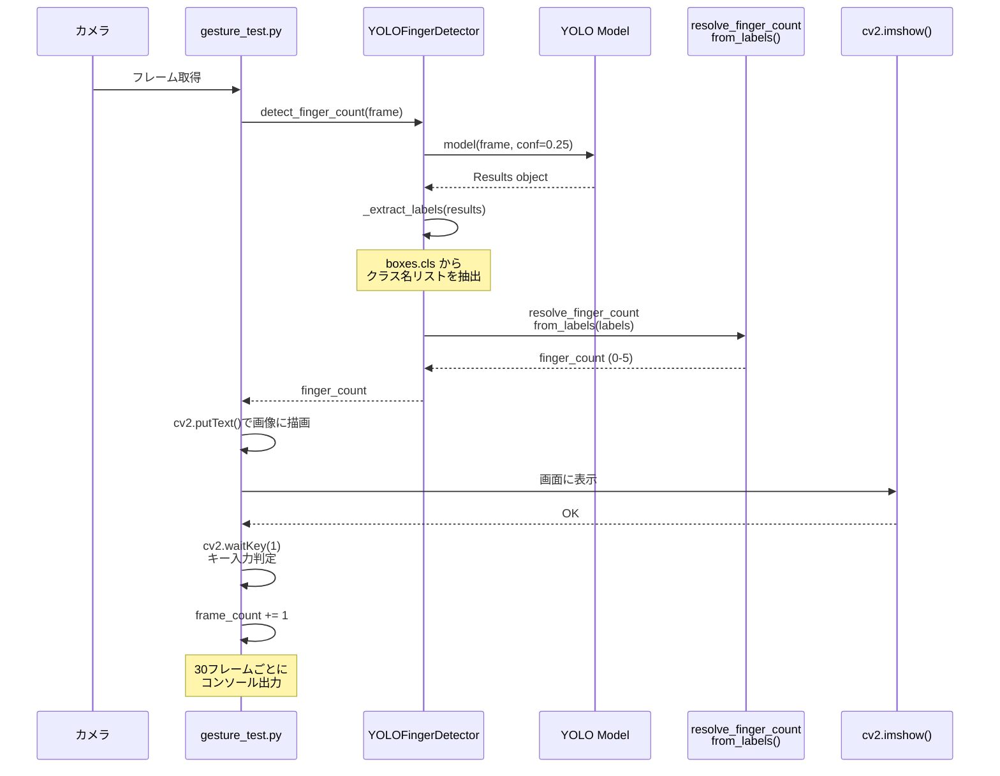

# YOLO ベース指検出システム

## フレーム処理シーケンス



## 処理フロー詳細

1. **フレーム取得**
   - `cv2.VideoCapture(0).read()` でカメラから画像を取得

2. **YOLO 推論**
   - `detector.detect_finger_count(frame)` でフレームを処理
   - 指定デバイス（CPU/GPU/NPU）で推論実行

3. **ラベル抽出**
   - `_extract_labels(results)` で検出結果からクラス名を抽出
   - 例：person, bottle, cup など

4. **指の本数に変換**
   - `resolve_finger_count_from_labels(labels)` でマッピング
   - 対象外のラベルの場合はデフォルト 0

5. **画面表示**
   - `cv2.putText()` で指の本数とデバイス情報を画像に描画
   - `cv2.imshow()` で画面に表示

6. **キー入力処理**
   - `cv2.waitKey(1)` で 'q' キーの終了入力を判定

7. **ログ出力**
   - 30フレームごとにコンソールに検出クラスと指の本数を出力

## 使用例

### CPU で実行
```bash
python -m my_camera_package.gesture_test cpu
```

### GPU（CUDA:0）で実行
```bash
python -m my_camera_package.gesture_test 0
```

### NPU（Intel Core Ultra）で実行
```bash
python -m my_camera_package.gesture_test npu
```

## デバイス対応表

| デバイス | コマンド | 備考 |
|---------|---------|------|
| CPU | `cpu` | デフォルト |
| NVIDIA GPU:0 | `0` または `cuda:0` | CUDA 対応 GPU |
| NVIDIA GPU:1 | `1` または `cuda:1` | |
| Intel NPU | `npu` | Core Ultra シリーズ（OpenVINO 必須） |
| Apple Neural Engine | `mps` | M1/M2/M3 チップ |

## 依存パッケージ

### 基本パッケージ（CPU推論）

```bash
pip install ultralytics
```

このコマンドで以下が自動的にインストールされます：
- torch（PyTorchフレームワーク）
- torchvision
- opencv-python
- numpy
- pillow
- pyyaml
- requests
- tqdm
- tensorboard

### GPU 対応パッケージ（NVIDIA CUDA）

CUDA を活用する場合は、PyTorch を **先にインストール** してください：

```bash
# CUDA 12.1 対応版（NVIDIA RTX 40シリーズ、RTX 30シリーズ等に推奨）
pip install torch torchvision torchaudio --index-url https://download.pytorch.org/whl/cu121

# その後 ultralytics をインストール
pip install ultralytics
```

または CUDA 11.8 を使用する場合：

```bash
pip install torch torchvision torchaudio --index-url https://download.pytorch.org/whl/cu118
pip install ultralytics
```

### NPU 対応パッケージ（Intel Core Ultra）

```bash
# OpenVINO ツールキット
pip install openvino openvino-dev

# その後 ultralytics をインストール
pip install ultralytics
```

### テスト用パッケージ

```bash
pip install pytest
```

### 完全セットアップ例（全デバイス対応）

```bash
# PyTorch GPU版（CUDA 12.1）
pip install torch torchvision torchaudio --index-url https://download.pytorch.org/whl/cu121

# YOLO + OpenVINO（NPU対応）
pip install ultralytics openvino openvino-dev

# テストツール
pip install pytest
```


## トラブルシューティング

### NPU 初期化エラー
OpenVINO がインストールされていない場合、自動的に CPU にフォールバックします。

```bash
pip install openvino openvino-dev
```

### カメラが開けない
USB カメラが接続されていることを確認してください。

```bash
# Linux での確認
ls /dev/video*
```

### YOLO モデルが自動ダウンロードされない
以下のコマンドで明示的にダウンロードしてください。

```bash
python -c "from ultralytics import YOLO; YOLO('yolov8n.pt')"
```

## 学習データの作成手順

標準的な YOLO v8 では COCO ベースのモデルを使用しているため、指の本数は検出できません。カスタムモデルを学習して指検出精度を向上させる手順です。

### 1. データセットの収集・アノテーション

#### 方法A: Roboflow を使用（推奨）

最も簡単な方法です。

```bash
# 1. Roboflow にアカウント登録
# https://roboflow.com

# 2. データセット作成
#   - カメラで指の画像を500～1000枚撮影
#   - Roboflow にアップロード
#   - アノテーション（Bounding Box）を実施
#   - クラス定義：one, two, three, four, five

# 3. YOLOv8 フォーマットでエクスポート
# Roboflow UI から "Export" > "YOLOv8" を選択
# ダウンロードリンクが生成される
```

#### 方法B: ローカルで LabelImg を使用

```bash
# LabelImg インストール
pip install labelimg

# 起動
labelimg

# 使い方：
# 1. "Open" からディレクトリを選択
# 2. "PascalVOC" 形式で保存（後で YOLO 形式に変換）
# 3. Bounding Box を描画してラベル付け
```

### 2. データセットディレクトリ構成

```
data/
├── images/
│   ├── train/
│   │   ├── image_001.jpg
│   │   ├── image_002.jpg
│   │   └── ...
│   └── val/
│       ├── image_100.jpg
│       └── ...
├── labels/
│   ├── train/
│   │   ├── image_001.txt  # YOLO フォーマット
│   │   ├── image_002.txt
│   │   └── ...
│   └── val/
│       ├── image_100.txt
│       └── ...
└── data.yaml  # データセット設定ファイル
```

### 3. YOLO ラベルフォーマット

`labels/train/image_001.txt` の例：

```
# 各行：<class_id> <x_center> <y_center> <width> <height>
# 正規化座標（0～1）
0 0.5 0.3 0.2 0.4
1 0.7 0.6 0.15 0.25
```

クラスIDマッピング：
- 0: one
- 1: two
- 2: three
- 3: four
- 4: five

### 4. data.yaml 設定ファイル

`data/data.yaml` を作成：

```yaml
path: /path/to/data  # データセットの絶対パス
train: images/train
val: images/val

nc: 5  # クラス数
names: ['one', 'two', 'three', 'four', 'five']  # クラス名
```

### 5. モデルの学習

```bash
# Python スクリプトで学習
python << 'PYTHON'
from ultralytics import YOLO

# 学習開始
model = YOLO('yolov8n.yaml')  # 新規モデルから学習
# または
model = YOLO('yolov8n.pt')    # 事前学習済みモデルから転移学習（推奨）

results = model.train(
    data='data/data.yaml',
    epochs=50,
    imgsz=640,
    device=0,  # GPU:0 を使用（CPU の場合は 'cpu'）
    patience=10,
    save=True,
    workers=4
)

PYTHON
```

### 6. 学習後のモデル使用

学習が完了すると `runs/detect/train/weights/best.pt` が生成されます。

```bash
# gesture_test.py で使用
python -m my_camera_package.gesture_test cpu \
  --model runs/detect/train/weights/best.pt
```

または、`gesture_test.py` を編集して：

```python
detector = YOLOFingerDetector(
    model_path='runs/detect/train/weights/best.pt',
    confidence=0.25,
    device='cpu'
)
```

### 7. モデル検証・テスト

学習後にテストセットで検証：

```bash
python << 'PYTHON'
from ultralytics import YOLO

model = YOLO('runs/detect/train/weights/best.pt')
metrics = model.val()

# 結果表示
print(f"mAP50: {metrics.box.map50}")
print(f"Precision: {metrics.box.p}")
print(f"Recall: {metrics.box.r}")

PYTHON
```

## ONNX フォーマットへの変換（Raspberry Pi 等への展開用）

### 背景

Raspberry Pi などのエッジデバイスで推論する場合、ONNX フォーマットが有用です：

- ファイルサイズ削減（50～60%）
- 推論速度向上（20～30%）
- CPU 最適化が効きやすい
- TensorFlow、CoreML、NNAPI への変換が容易

### ONNX 変換手順

#### 1. 変換コマンド

```bash
python << 'PYTHON'
from ultralytics import YOLO

# 学習済みモデルをロード
model = YOLO('runs/detect/train/weights/best.pt')

# ONNX フォーマットにエクスポート
model.export(
    format='onnx',
    imgsz=640,
    half=False,  # True の場合は float16（精度は低下だが高速）
    device=0     # GPU を使用（複数枚エクスポートなら CPU の場合は 'cpu'）
)

print("✅ ONNX モデルが生成されました: runs/detect/train/weights/best.onnx")

PYTHON
```

#### 2. 変換後のファイル

```
runs/detect/train/weights/
├── best.pt          # 元の PyTorch モデル（~50MB）
├── best.onnx        # ONNX フォーマット（~25MB）
└── best_saved_model/  # TensorFlow フォーマット（オプション）
```

### Raspberry Pi での ONNX 推論

#### 1. Raspberry Pi 環境セットアップ

```bash
# Raspberry Pi OS で実行

# Python 環境準備
sudo apt-get update
sudo apt-get install -y python3-pip python3-venv libatlas-base-dev libjasper-dev libtiff5 libjasper1

# 仮想環境作成
python3 -m venv ~/yolo_env
source ~/yolo_env/bin/activate

# 軽量パッケージのインストール
pip install --upgrade pip
pip install opencv-python numpy pillow
pip install onnxruntime  # 軽量（PyTorch より 100倍小さい）
pip install onnx
```

#### 2. Raspberry Pi での推論スクリプト

```bash
python << 'PYTHON'
import cv2
import onnxruntime as rt
import numpy as np

# ONNX モデルをロード
sess = rt.InferenceSession('best.onnx')

# カメラから画像取得
cap = cv2.VideoCapture(0)

while True:
    ret, frame = cap.read()
    if not ret:
        break
    
    # 前処理（YOLO v8 標準）
    img = cv2.resize(frame, (640, 640))
    img = img.astype(np.float32) / 255.0
    img = np.transpose(img, (2, 0, 1))  # HWC -> CHW
    img = np.expand_dims(img, axis=0)   # バッチ追加
    
    # 推論実行
    input_name = sess.get_inputs()[0].name
    outputs = sess.run(None, {input_name: img})
    
    # 結果処理（省略）
    print(f"Inference done: {outputs[0].shape}")
    
    key = cv2.waitKey(1) & 0xFF
    if key == ord('q'):
        break

cap.release()
cv2.destroyAllWindows()

PYTHON
```

### ファイルサイズ・速度比較

| フォーマット | ファイルサイズ | Raspberry Pi 推論時間 | 備考 |
|-------------|-------------|-------------------|------|
| `.pt`（PyTorch） | ~50MB | 2～3秒/フレーム | PC 推奨、RPi では遅い |
| `.onnx`（ONNX） | ~25MB | 0.5～1秒/フレーム | **RPi 推奨** |
| `.tflite`（TFLite） | ~20MB | 0.3～0.8秒/フレーム | 最軽量（さらに変換が必要） |

### Raspberry Pi でのベストプラクティス

1. **モデルサイズを小さくする**
   ```bash
   model = YOLO('yolov8n.pt')  # nano 版を使用
   # yolov8n（nano）< yolov8s（small）< yolov8m（medium）
   ```

2. **量子化を活用（さらに軽量化）**
   ```bash
   python << 'PYTHON'
   from ultralytics import YOLO
   
   model = YOLO('best.pt')
   model.export(format='onnx', half=True)  # float16 で精度と速度のバランスを取る
   
   PYTHON
   ```

3. **推論フレームレートを下げる**
   ```bash
   # 毎フレーム推論ではなく、3フレームごとに推論
   if frame_count % 3 == 0:
       finger_count = detector.detect_finger_count(frame)
   ```


## 学習時間・リソース要件

1000枚のデータセット、epochs=50 での推定学習時間

| デバイス | 型番 | メモリ | 推定学習時間 |
|---------|------|--------|------------|
| NVIDIA GPU | RTX 4090 | 24GB | 5～10分 |
| NVIDIA GPU | RTX 3080 | 10GB | 15～30分 |
| NVIDIA GPU | **RTX A2000** | **6GB** | **40～90分** |
| NVIDIA GPU | RTX 3050 | 8GB | 35～70分 |
| Intel CPU | i7-13700K（第13世代） | 64GB | 45～90分 |
| **Intel CPU** | **Core Ultra 7 165H（モバイル）** | **32GB** | **70～120分** |
| Intel CPU | i7-1280P（モバイル第12世代） | 32GB | 2～3時間 |
| Intel CPU | i7-6700（第6世代）※古い | 16GB | **3～5時間以上** |

**注意**：CPU での学習は GPU に比べて大幅に遅くなります。GPU の使用を推奨します。

## 参考資料

- [Roboflow - Object Detection Dataset Platform](https://roboflow.com)
- [Ultralytics YOLOv8 Documentation](https://docs.ultralytics.com)
- [LabelImg GitHub](https://github.com/heartexlabs/labelImg)
- [ONNX Runtime Documentation](https://onnxruntime.ai)
- [ONNX Model Export（Ultralytics）](https://docs.ultralytics.com/modes/export/)
- [Raspberry Pi で YOLO を動かす](https://github.com/ultralytics/yolov5/wiki/Raspberry-Pi)


